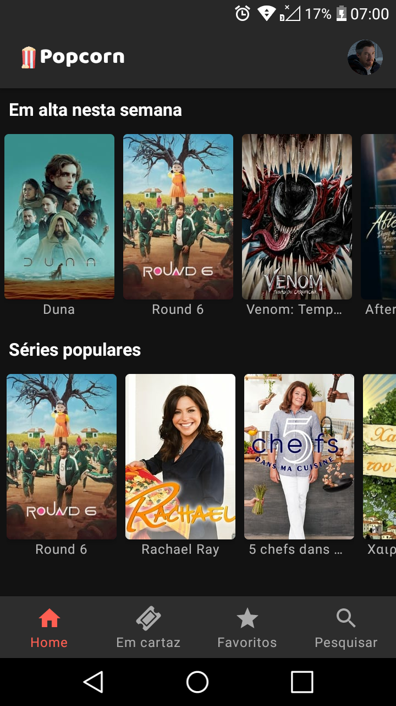

<h1 align="center"> 🍿 Popcorn </h1>

<p align="center">


</p>

<p align="center">
 <a href="./README.md">Readme in English </a> •
 <a href="#information_source-sobre">Sobre</a> •
 <a href="#iphone-baixar-o-aplicativo">Baixar o aplicativo</a> •
 <a href="#hammer-configurando-o-projeto">Configurando o projeto</a> •
 <a href="#rocket-tecnologias-e-recursos">Tecnologias e recursos</a> •
 <a href="#memo--licença">Licença</a>
</p>

<p align="center">



</p>

## :information_source: Sobre

Este aplicativo foi criado com o objetivo de estudar mais sobre a arquitetura MVVM, Retrofit, Coroutines, Firebase e Material Design.

Com este aplicativo você pode pesquisar sobre filmes e séries, ver quais estão em alta, e salvar na sua lista de favoritos. É possível também ver quais filmes estão em cartaz no seu pais. O aplicativo está disponível em Português e Inglês e seu conteúdo está disponível nos [idiomas suportados](https://developers.themoviedb.org/3/configuration/get-languages) pela API do TMDB.

O aplicativo também conta com um tema claro e escuro que pode ser alterado nas configurações.


## :iphone: Baixar o aplicativo

Você pode fazer baixar o aplicativo clicando neste [link](https://github.com/Vitor238/Popcorn/releases/latest/download/popcorn.apk).

## :hammer: Configurando o projeto

1. Clone o projeto copiando este comando no seu terminal:

   ```bash
   git clone https://github.com/Vitor238/Popcorn.git
   ```

2. Abra o projeto no Android Studio

3. Altere o nome dos pacotes do projeto. Veja como [aqui](https://stackoverflow.com/a/29092698/9729980).

4. Crie um novo projeto no [Firebase](https://console.firebase.google.com/) e adicione o app. Veja como [aqui](https://firebase.google.com/docs/android/setup).

5. Crie uma nova conta e gere uma chave de API no [TMDB](https://developers.themoviedb.org/3/getting-started/introduction)

6. Adicione as chaves de API do TMDB e a [ID do cliente do servidor  do Firebase](https://firebase.google.com/docs/auth/android/google-signin?hl=pt-Br#authenticate_with_firebase) ao arquivo "local.properties":

```groovy
TMDB_API_KEY=1234567890abcd
DEFAULT_WEB_CLIENT_ID=123456example.apps.googleusercontent.com
```

7. Execute o aplicativo

## :rocket: Tecnologias e recursos

- [Componentes da arquitetura do Android](https://developer.android.com/topic/libraries/architecture?hl=pt-br)
- [Corrotinas](https://developer.android.com/kotlin/coroutines?hl=pt-br)
- [Firebase Cloud Firestore](https://firebase.google.com/docs/firestore/quickstart?hl=pt-br)
- [Firebase Crashlytics](https://firebase.google.com/docs/crashlytics/get-started?hl=pt-br&platform=android)
- [Firebase Email Auth](https://firebase.google.com/docs/auth/android/password-auth?hl=pt-br)
- [Firebase Google Auth](https://firebase.google.com/docs/auth/android/google-signin?hl=pt)
- [Firebase Storage](https://firebase.google.com/docs/storage/android/start?hl=pt-br)
- [Glide](https://github.com/bumptech/glide)
- [Moshi](https://github.com/square/moshi)
- [Preferências](https://developer.android.com/jetpack/androidx/releases/preference?hl=pt-br)
- [Retrofit](https://github.com/square/retrofit)
- [Secrets Gradle Plugin](https://github.com/google/secrets-gradle-plugin)
- [The Movie Database API](https://www.themoviedb.org/documentation/api)


## :memo:  Licença

Este projeto está licenciado sob a [Licença Apache 2](https://www.apache.org/licenses/LICENSE-2.0https://www.apache.org/licenses/LICENSE-2.0) - consulte o arquivo [LICENSE](LICENSE) para mais detalhes.
