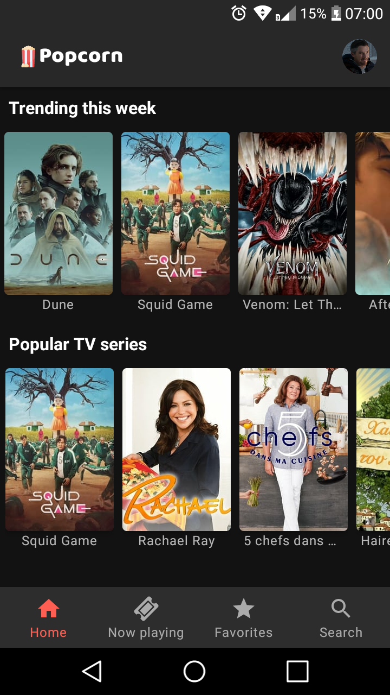
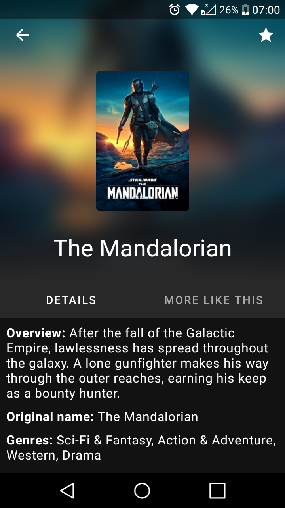
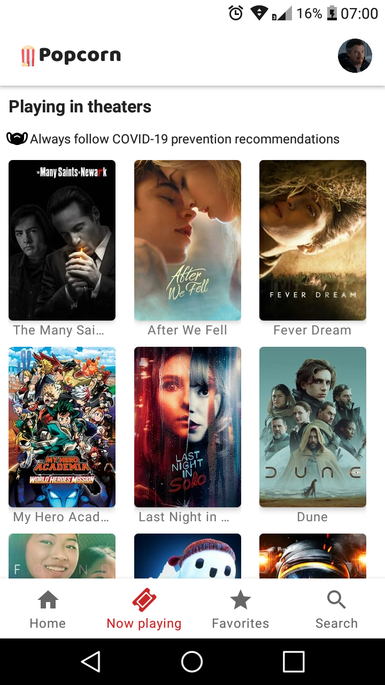
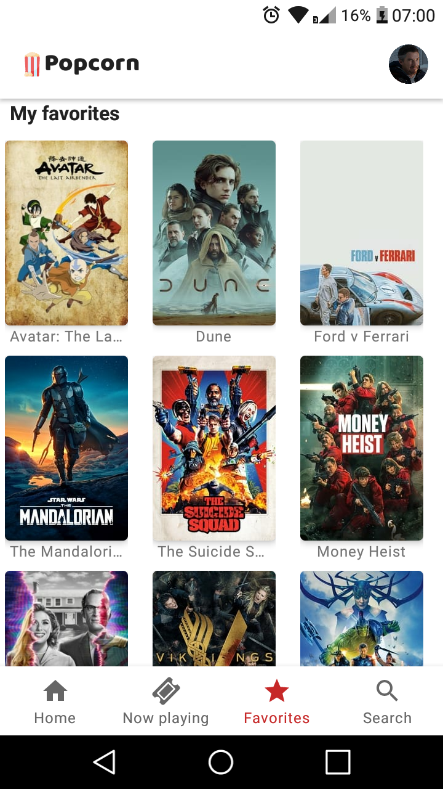

<h1 align="center"> 🍿 Popcorn </h1>

<p align="center">


</p>

<p align="center">




</p>

## :information_source: About

This application was created with the aim of studying more about the MVVM architecture, Retrofit, Coroutines, Firebase Auth and Firebase Cloud Firestore.

With this app you can search for movies and series, see which ones are trending, and save to your favorites list. You can also see which movies are playing in your country’s cinemas. The application is available in Portuguese and English and its content is available in [supported languages](https://developers.themoviedb.org/3/configuration/get-languages) through the TMDB API.

The application also has a light and dark theme that can be changed in the settings.

## :iphone: Download app

You can download it by clicking on this [link](https://github.com/Vitor238/Popcorn/releases/download/v1.0.0/popcorn.apk).

## :hammer: Building the project

1. Clone the project by copying this command to your terminal:

   ```bash
   git clone https://github.com/Vitor238/Popcorn.git
   ```

2. Open the project in Android Studio

3. Change the name of the project packages. See how [here](https://stackoverflow.com/a/29092698/9729980).

4. Create a new project on [Firebase](https://console.firebase.google.com/) and add the app. See how [here](https://firebase.google.com/docs/android/setup).

5. Create a new account and generate an API key in [TMDB](https://developers.themoviedb.org/3/getting-started/introduction)

6. Create a new file named "ApiKeys.kt" in the "utils" package with the following code:

```kotlin
object ApiKeys {

    val TMDB_API_KEY: String = "YOUR API KEY"
}
```

7. Run the app

## :rocket: Technogies and resources

- [Retrofit](https://github.com/square/retrofit)

- [Moshi](https://github.com/square/moshi)

- [Android Architecture Components](https://developer.android.com/topic/libraries/architecture)

- [Firebase Email Auth](https://firebase.google.com/docs/auth/android/password-auth)

- [Firebase Google Auth](https://firebase.google.com/docs/auth/android/google-signin)

- [Firebase Cloud Firestore](https://firebase.google.com/docs/firestore/quickstart)

- [Firebase Crashlytics](https://firebase.google.com/docs/crashlytics/get-started?platform=android)

- [Firebase Storage](https://firebase.google.com/docs/storage/android/start)

- [Glide](https://github.com/bumptech/glide)

- [The Movie Database API](https://www.themoviedb.org/documentation/api)

- [Preferences](https://developer.android.com/jetpack/androidx/releases/preference)

## :memo:  License

This project is licensed under the [Apache 2 License](https://www.apache.org/licenses/LICENSE-2.0https://www.apache.org/licenses/LICENSE-2.0) - see the [LICENSE](LICENSE) file for details.
